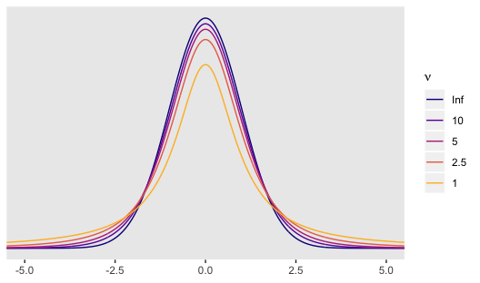
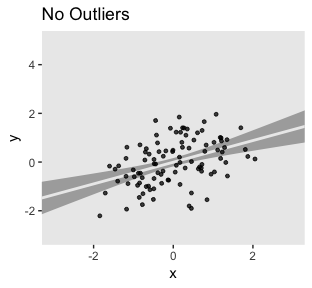
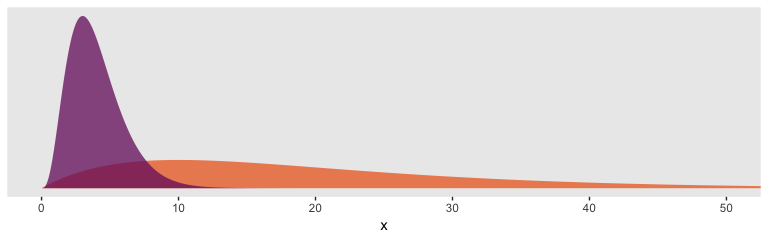
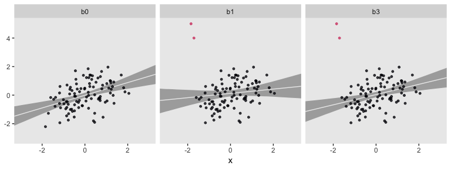

Robust Linear Regression with Student’s T Distribution
======================================================

The purpose of this project is to demonstrate the advantages of the Student's *t* distribution for regression with outliers, particularly within a [Bayesian framework](https://www.youtube.com/channel/UCNJK6_DZvcMqNSzQdEkzvzA/playlists).

For this project, I’m presuming you are familiar with linear regression, familiar with the basic differences between frequentist and Bayesian approaches to fitting regression models, and have a sense that the issue of outlier values is a pickle worth contending with. All code in is [R](https://www.r-bloggers.com/why-use-r-five-reasons/), with a heavy use of the [tidyverse](http://style.tidyverse.org)--which you might learn a lot about [here, especially chapter 5](http://r4ds.had.co.nzhttp://r4ds.had.co.nz)--, and the [brms](https://cran.r-project.org/web/packages/brms/index.html) package.

The problem
-----------

Regression models typically use the Gaussian likelihood. The Gaussian likelihood is a sensible default choice for many data types. Unfortunately, the normal (i.e., Gaussian) distribution is sensitive to outliers.

The normal distribution is a special case of Student's *t* distribution with the *nu* parameter (i.e., the degree of freedom) set to infinity. However, when *nu* is small, Student's *t* distribution is more robust to multivariate outliers. See [Gelman & Hill (2007, chapter 6)](http://www.stat.columbia.edu/~gelman/arm/) or [Kruschke (2014, chapter 16)](https://sites.google.com/site/doingbayesiandataanalysis/) for textbook treatments on the topic.

In this project, we demonstrate how vulnerable the Gaussian likelihood is to outliers and then compare it too different ways of using Student's *t* likelihood for the same data.

First, we'll get a sense of the distributions with a plot.

``` r
library(tidyverse)

tibble(x = seq(from = -6, to = 6, by = .01)) %>% 
  expand(x, nu = c(1, 2.5, 5, 10, Inf)) %>% 
  mutate(density = dt(x = x, df = nu),
         nu      = factor(nu, levels = c("Inf", "10", "5", "2.5", "1"))) %>% 
  
  ggplot(aes(x = x, y = density, group = nu, color = nu)) +
  geom_line() +
  scale_color_viridis_d(expression(nu),
                        direction = 1, option = "C", end = .85) +
  scale_y_continuous(NULL, breaks = NULL) +
  coord_cartesian(xlim = -5:5) +
  xlab(NULL) +
  theme(panel.grid = element_blank())
```



So the difference is that a Student's *t* with a low *nu* will have notably heavier tails than the conventional Gaussian distribution. It’s easiest to see the difference when *nu* approaches 1. Even then, the difference can be subtle when looking at a plot. Another way is to compare how probable relatively extreme values are in a Student's *t* distribution relative to the Gaussian. For the sake of demonstration, here we'll compare Gauss with Student's *t* with a *nu* of 5. In the plot above, they are clearly different, but not shockingly so. However, that difference is very notable in the tails.

Let’s look closer with our table.

In the table, below, we compare the probability of a given Z score or lower within the Gaussian and a *nu* = 5 Student's *t*. In the rightmost column, we compare the probabilities in a ratio.

``` r
# Here we pic our nu
nu <- 5

tibble(Z_score               = 0:-5,
       p_Gauss               = pnorm(Z_score, mean = 0, sd = 1),
       p_Student_t           = pt(Z_score, df = nu),
       `Student/Gauss ratio` = p_Student_t/p_Gauss) %>%
  mutate_if(is.double, round, digits = 5)
```

    ## # A tibble: 6 x 4
    ##   Z_score p_Gauss p_Student_t `Student/Gauss ratio`
    ##     <int>   <dbl>       <dbl>                 <dbl>
    ## 1       0 0.5         0.5                      1   
    ## 2      -1 0.159       0.182                    1.14
    ## 3      -2 0.0228      0.0510                   2.24
    ## 4      -3 0.00135     0.0150                  11.1 
    ## 5      -4 0.00003     0.00516                163.  
    ## 6      -5 0           0.00205               7160.

Note how low Z scores are more probable in this Student’s *t* than in the Gaussian. This is most apparent in the `Student/Gauss ratio` column on the right. A consequence of this is that extreme scores are less influential to your solutions when you use a small-*nu* Student’s *t* distribution in place of the Gaussian. That is, the small-*nu* Student’s *t* is more robust than the Gaussian to unusual and otherwise influential observations.

In order to demonstrate, let's simulate our own. We'll start by creating multivariate normal data.

Let's create our initial [tibble](https://cran.r-project.org/web/packages/tibble/vignettes/tibble.html) of well-behaved data, `d`
---------------------------------------------------------------------------------------------------------------------------------

First, we'll need to define our variance/covariance matrix.

``` r
# ?matrix
s <- matrix(c(1, .6, 
              .6, 1), 
             nrow = 2, ncol = 2)
```

By the two `.6`s on the off-diagonal positions, we indicate we'd like our two variables to have a correlation of .6.

Second, our variables also need means, which we'll define with a mean vector.

``` r
m <- c(0, 0)
```

With means of `0` and variances of `1`, our data are in a standardized metric.

Third, we'll use the `mvrnorm()` function from the [MASS package](https://cran.r-project.org/web/packages/MASS/index.html) to simulate our data.

``` r
set.seed(3)
d <- MASS::mvrnorm(n = 100, mu = m, Sigma = s) %>%
  as_tibble() %>%
  rename(y = V1, x = V2)
```

The first few rows look like so:

``` r
head(d)
```

    ## # A tibble: 6 x 2
    ##         y      x
    ##     <dbl>  <dbl>
    ## 1 -1.14   -0.584
    ## 2 -0.0805 -0.443
    ## 3 -0.239   0.702
    ## 4 -1.30   -0.761
    ## 5 -0.280   0.630
    ## 6 -0.245   0.299

Side note. For more information on simulating data, check out [this nice r-bloggers post](https://www.r-bloggers.com/creating-sample-datasets-exercises/).

This line reorders our data by `x`, placing the smallest values on top.

``` r
d <-
  d %>%
  arrange(x)

head(d)
```

    ## # A tibble: 6 x 2
    ##        y     x
    ##    <dbl> <dbl>
    ## 1 -2.21  -1.84
    ## 2 -1.27  -1.71
    ## 3 -0.168 -1.60
    ## 4 -0.292 -1.46
    ## 5 -0.785 -1.40
    ## 6 -0.157 -1.37

Let's create our outlier tibble, `o`
------------------------------------

Here we'll make two outlying and unduly influential values.

``` r
o <- d

o[c(1:2), 1] <- c(5, 4)

head(o)
```

    ## # A tibble: 6 x 2
    ##        y     x
    ##    <dbl> <dbl>
    ## 1  5     -1.84
    ## 2  4     -1.71
    ## 3 -0.168 -1.60
    ## 4 -0.292 -1.46
    ## 5 -0.785 -1.40
    ## 6 -0.157 -1.37

With the code, above, we replaced the first two values of our first variable, `y`. They both started out quite negative. Now they are positive values of a large magnitude in the standardized metric.

Frequentist OLS models
----------------------

To get a quick sense of what we've done, we'll first fit two models with OLS regression. The first model, `fit0`, is of the multivariate normal data, `d`. The second model, `fit1`, is on the otherwise identical data with the two odd and influential values, `o`. Here is our model code.

``` r
fit0 <- lm(data = d, y ~ 1 + x)
fit1 <- lm(data = o, y ~ 1 + x)
```

We'll use the [broom package](https://cran.r-project.org/web/packages/broom/index.html) to assist with model summaries and other things.

Here are the parameter estimates for the first model.

``` r
library(broom)

tidy(fit0) %>% mutate_if(is.double, round, digits = 2)
```

    ##          term estimate std.error statistic p.value
    ## 1 (Intercept)    -0.01      0.09     -0.08    0.94
    ## 2           x     0.45      0.10      4.55    0.00

And now the parameters for the second model, the one based on the `o` outlier data.

``` r
tidy(fit1) %>% mutate_if(is.double, round, digits = 2)
```

    ##          term estimate std.error statistic p.value
    ## 1 (Intercept)     0.12      0.11      1.12    0.26
    ## 2           x     0.15      0.13      1.21    0.23

Just two odd and influential values dramatically changed the model parameters, particularly the slope. Let's plot the data and the models to get a visual sense of what happened.

``` r
# The well-behaived data
ggplot(data = d, aes(x = x, y = y)) +
  stat_smooth(method = "lm", color = "grey92", fill = "grey67", alpha = 1, fullrange = T) +
  geom_point(size = 1, alpha = 3/4) +
  scale_x_continuous(limits = c(-4, 4)) +
  coord_cartesian(xlim = -3:3, 
                  ylim = -3:5) +
  labs(title = "No Outliers") +
  theme(panel.grid = element_blank())
```



``` r
# The data with two outliers
ggplot(data = o, aes(x = x, y = y, color = y > 3)) +
  stat_smooth(method = "lm", color = "grey92", fill = "grey67", alpha = 1, fullrange = T) +
  geom_point(size = 1, alpha = 3/4) +
  scale_color_viridis_d(option = "A", end = 4/7) +
  scale_x_continuous(limits = c(-4, 4)) +
  coord_cartesian(xlim = -3:3, 
                  ylim = -3:5) +
  labs(title = "Two Outliers") +
  theme(panel.grid = element_blank(),
        legend.position = "none")
```


The two outliers were quite influential on the slope. It went from a nice clear diagonal to almost horizontal. You'll also note how the 95% intervals (i.e., the bowtie shape) were a bit wider when based on the `o` data.

One of the popular ways to quantify outlier status is with Mahalanobis' distance. However, the Mahalanobis distance is primarilly valid for multivariate normal data. Though the data in this example are indeed multivariate normal--or at least they were before we injected two outlying values into them--I am going to resist relying on Mahalanobis' distance. There are other more general approaches that will be of greater use when you need to explore other variants of the generalized linear model. The `broom::augment()` function will give us access to one.

``` r
aug0 <- augment(fit0)
aug1 <- augment(fit1)

glimpse(aug1)
```

    ## Observations: 100
    ## Variables: 9
    ## $ y          <dbl> 5.00000000, 4.00000000, -0.16783167, -0.29164105, -...
    ## $ x          <dbl> -1.8439208, -1.7071418, -1.5996509, -1.4601550, -1....
    ## $ .fitted    <dbl> -0.155937416, -0.135213012, -0.118926273, -0.097790...
    ## $ .se.fit    <dbl> 0.2581834, 0.2427649, 0.2308204, 0.2155907, 0.20864...
    ## $ .resid     <dbl> 5.15593742, 4.13521301, -0.04890540, -0.19385084, -...
    ## $ .hat       <dbl> 0.05521164, 0.04881414, 0.04412882, 0.03849763, 0.0...
    ## $ .sigma     <dbl> 0.964211, 1.017075, 1.104423, 1.104253, 1.102081, 1...
    ## $ .cooksd    <dbl> 6.809587e-01, 3.820802e-01, 4.783890e-05, 6.480561e...
    ## $ .std.resid <dbl> 4.82755612, 3.85879897, -0.04552439, -0.17992001, -...

Here we can compare the observations with Cook's distance, *D*<sub>*i*</sub> (i.e., `.cooksd`). Cook's *D*<sub>*i*</sub> is a measure of the influence of a given observation on the model. To compute *D*<sub>*i*</sub>, the model is fit once for each *n* case, after first dropping that case. Then the difference in the model with all observations and the model with all observations but the *i*th observation, as defined by the Euclidian distance between the estimators. [Fahrmeir et al (2013, p. 166)](http://www.springer.com/us/book/9783642343322#aboutBook) suggest that within the OLS framework "as a rule of thumb, observations with *D*<sub>*i*</sub> &gt; 0.5 are worthy of attention, and observations with *D*<sub>*i*</sub> &gt; 1 should always be examined." Here we plot *D*<sub>*i*</sub> against our observation index, *i*, for both models.

``` r
aug0 %>%  # The well-behaived data
  mutate(i = 1:n()) %>%
  bind_rows(  # The data with two outliers
    aug1 %>%
      mutate(i = 1:n())
    ) %>%
  mutate(fit = rep(c("fit b0", "fit b1"), each = n()/2)) %>%

  ggplot(aes(x = i, y = .cooksd)) +
  geom_hline(yintercept = .5, color = "white") +
  geom_point(alpha = .5) +
  geom_text(data = tibble(i = 46, 
                          .cooksd = .53,
                          fit = "fit b0"),
            label = "Fahrmeir et al said we might worry around here",
            color = "grey50") +
  coord_cartesian(ylim = c(0, .7)) +
  theme(panel.grid = element_blank(),
        axis.title.x = element_text(face = "italic", family = "Times")) +
    facet_wrap(~fit)
```


For the model of the well-behaved data, `fit0`, we have *D*<sub>*i*</sub> values all hovering near zero. However, the plot for `fit1` shows one *D*<sub>*i*</sub> value well above the 0.5 level and another not quite that high but deviant relative to the rest. Our two outlier values look quite influential for the results of `fit1`.

Switch to a Bayesian framework
------------------------------

In this project, we'll use the [brms package](https://cran.r-project.org/web/packages/brms/index.html) to fit our Bayesian regression models. You can learn a lot about brms [here](https://cran.r-project.org/web/packages/brms/vignettes/brms_overview.pdf) and [here](https://github.com/paul-buerkner/brms). To keep things simple, we'll use [weakly-regularizing priors](https://github.com/stan-dev/stan/wiki/Prior-Choice-Recommendations).

``` r
library(brms)
```

### Stick with Gauss.

For our first two Bayesian models, `b0` and `b1`, we'll use the conventional Gaussian likelihood (i.e., `family = gaussian` in the `brm()` function). Like with `fit01`, above, the first model is based on the nice `d` data. The second, `b1`, is based on the more-difficult `o` data.

``` r
b0 <- 
  brm(data = d, family = gaussian,
      y ~ 1 + x,
      prior = c(prior(normal(0, 100), class = Intercept),
                prior(normal(0, 10),  class = b),
                prior(cauchy(0, 1),   class = sigma)))

b1 <- 
  update(b0, 
         newdata = o)
```

Here are the model summaries.

``` r
tidy(b0) %>% slice(1:3) %>% mutate_if(is.double, round, digits = 2)
```

    ##          term estimate std.error lower upper
    ## 1 b_Intercept    -0.01      0.09 -0.15  0.13
    ## 2         b_x     0.44      0.10  0.28  0.61
    ## 3       sigma     0.86      0.06  0.77  0.97

``` r
tidy(b1) %>% slice(1:3) %>% mutate_if(is.double, round, digits = 2)
```

    ##          term estimate std.error lower upper
    ## 1 b_Intercept     0.12      0.11 -0.05  0.30
    ## 2         b_x     0.15      0.13 -0.06  0.37
    ## 3       sigma     1.11      0.08  0.98  1.24

These should look familiar. They're very much like the results from the OLS models. Hopefully this isn't surprising. Our priors were quite weak, so there's no reason to suspect the results would differ much.

#### The LOO and other goodies help with diagnostics.

With the `loo()` function, we'll extract loo objects, which contain some handy output.

``` r
loo_b0 <- loo(b0)
loo_b1 <- loo(b1)
```

    ## Warning: Found 1 observations with a pareto_k > 0.7 in model 'b1'. It is
    ## recommended to set 'reloo = TRUE' in order to calculate the ELPD without
    ## the assumption that these observations are negligible. This will refit
    ## the model 1 times to compute the ELPDs for the problematic observations
    ## directly.

We'll use `str()` to get a sense of what's all in there, using `loo_b1` as an example.

``` r
str(loo_b1)
```

    ## List of 11
    ##  $ estimates  : num [1:3, 1:2] -155.87 6.96 311.73 15.64 4.14 ...
    ##   ..- attr(*, "dimnames")=List of 2
    ##   .. ..$ : chr [1:3] "elpd_loo" "p_loo" "looic"
    ##   .. ..$ : chr [1:2] "Estimate" "SE"
    ##  $ pointwise  : num [1:100, 1:4] -14.4 -9.11 -1.04 -1.06 -1.25 ...
    ##   ..- attr(*, "dimnames")=List of 2
    ##   .. ..$ : NULL
    ##   .. ..$ : chr [1:4] "elpd_loo" "mcse_elpd_loo" "p_loo" "looic"
    ##  $ diagnostics:List of 2
    ##   ..$ pareto_k: num [1:100] 0.8601 0.59858 0.01056 0.04748 -0.00126 ...
    ##   ..$ n_eff   : num [1:100] 29.5 274.1 3974.1 3971.7 3924 ...
    ##  $ psis_object: NULL
    ##  $ elpd_loo   : num -156
    ##  $ p_loo      : num 6.96
    ##  $ looic      : num 312
    ##  $ se_elpd_loo: num 15.6
    ##  $ se_p_loo   : num 4.14
    ##  $ se_looic   : num 31.3
    ##  $ model_name : chr "b1"
    ##  - attr(*, "dims")= int [1:2] 4000 100
    ##  - attr(*, "class")= chr [1:3] "ic" "psis_loo" "loo"
    ##  - attr(*, "yhash")= chr "5cdc17bb2cb41f3e3f0a617f418fff3fbb8e1ebf"

For a detailed explanation of all those elements, see the [reference manual](https://cran.r-project.org/web/packages/loo/loo.pdf). For our purposes, we'll focus on `pareto_k`. Here's a glimpse of what it contains for the `b1` model.

``` r
loo_b1$diagnostics$pareto_k %>% as_tibble()
```

    ## # A tibble: 100 x 1
    ##       value
    ##       <dbl>
    ##  1  0.860  
    ##  2  0.599  
    ##  3  0.0106 
    ##  4  0.0475 
    ##  5 -0.00126
    ##  6  0.0239 
    ##  7 -0.00829
    ##  8 -0.0499 
    ##  9  0.252  
    ## 10  0.0288 
    ## # ... with 90 more rows

We've got us a numeric vector of as many values as our data had observations--100 in this case. The `pareto_k` values can be used to examine overly-influential cases. See, for example [this discussion on stackoverflow.com](https://stackoverflow.com/questions/39578834/linear-model-diagnostics-for-bayesian-models-using-rstan/39595436) in which several members of the [Stan team](http://mc-stan.org) weighed in. The issue is also discussed in [this paper](https://arxiv.org/abs/1507.04544), in the [loo reference manual](https://cran.r-project.org/web/packages/loo/loo.pdf), and in [this presentation by Aki Vehtari](https://www.youtube.com/watch?v=FUROJM3u5HQ&feature=youtu.be&a=). If we explicitly open the [loo package](https://cran.r-project.org/web/packages/loo/index.html), we can use a few convenience functions to leverage `pareto_k` for diagnostic purposes. The `pareto_k_table()` function will categorize the `pareto_k` values and give us a sense of how many values are in problematic ranges.

``` r
library(loo)

pareto_k_table(loo_b1)
```

    ## Pareto k diagnostic values:
    ##                          Count Pct.    Min. n_eff
    ## (-Inf, 0.5]   (good)     98    98.0%   3520      
    ##  (0.5, 0.7]   (ok)        1     1.0%   274       
    ##    (0.7, 1]   (bad)       1     1.0%   29        
    ##    (1, Inf)   (very bad)  0     0.0%   <NA>

Happily, most of our cases were in the "good" range. One pesky case was in the "bad" range \[can you guess which one?\] and another case was only "ok" \[and can you guess that one, too?\]. The `pareto_k_ids()` function will tell exactly us which cases we'll want to look at.

``` r
pareto_k_ids(loo_b1)
```

    ## [1] 1 2

Those numbers correspond to the row numbers in the data, `o`. These are exactly the cases that plagued our second OLS model, `fit1`, and are also the ones we hand coded to be outliers.

With the simple `plot()` function, we can get a diagnostic plot for the `pareto_k` values.

``` r
plot(loo_b1)
```


There they are, cases 1 and 2, lurking in the "bad" and "\[just\] ok" ranges. We can also make a similar plot with ggplot2. Though it takes a little more work, ggplot2 makes it easy to compare `pareto_k` plots across models with a little faceting.

``` r
loo_b0$diagnostics$pareto_k %>%  # The well-behaived data
  as_tibble() %>%
  mutate(i = 1:n()) %>%
  bind_rows(  # The data with two outliers
    loo_b1$diagnostics$pareto_k %>% 
      as_tibble() %>%
      mutate(i = 1:n()) 
  ) %>%
  rename(pareto_k = value) %>%
  mutate(fit = rep(c("fit b0", "fit b1"), each = n()/2)) %>%

  ggplot(aes(x = i, y = pareto_k)) +
  geom_hline(yintercept = c(.5, .7, 1), color = "white") +
  geom_point(alpha = .5) +
  geom_text(data = tibble(i = c(3, 6, 2), 
                          pareto_k = c(.45, .65, .95),
                          label = c("good", "[just] ok", "bad"),
                          fit = "fit b0"),
            aes(label = label),
            color = "grey50") +
  theme(panel.grid = element_blank(),
        axis.title.x = element_text(face = "italic", family = "Times")) +
  facet_wrap(~fit)
```


So with `b0`--the model based on the well-behaved multivariate normal data, `d`--, all the `pareto_k` values hovered around zero in the "good" range. Things got concerning with model `b1`. But we know all that. Let's move forward.

#### What do we do with those overly-influential outlying values?

A typical way to handle outlying values is to delete them based on some criterion, such as the Mahalanobis distance, Cook's *D*<sub>*i*</sub>, or our new friend the `pareto_k`. In our next two models, we'll do that. In our `data` arguments, we can use the `slice()` function to omit cases. In model `b1.1`, we simply omit the first and most influential case. In model `b1.2`, we omitted both unduly-influential cases, the values from rows 1 and 2.

``` r
b1.1 <- 
  update(b1, 
         newdata = o %>% slice(2:100))

b1.2 <- 
  update(b1, 
         newdata = o %>% slice(3:100))
```

Here are the summaries for our models based on the `slice[d]` data.

``` r
tidy(b1.1) %>% slice(1:3) %>% mutate_if(is.double, round, digits = 2)
```

    ##          term estimate std.error lower upper
    ## 1 b_Intercept     0.07      0.10 -0.09  0.23
    ## 2         b_x     0.29      0.11  0.10  0.47
    ## 3       sigma     0.97      0.07  0.87  1.10

``` r
tidy(b1.2) %>% slice(1:3) %>% mutate_if(is.double, round, digits = 2)
```

    ##          term estimate std.error lower upper
    ## 1 b_Intercept     0.01      0.09 -0.13  0.16
    ## 2         b_x     0.40      0.10  0.23  0.57
    ## 3       sigma     0.86      0.06  0.76  0.97

They are closer to the true data generating model (i.e., the code we used to make `d`), especially `b1.2`. However, there are other ways to handle the influential cases without dropping them. Finally, we're ready to switch to Student's *t*!

### Time to leave Gauss for the more general Student's *t*

Recall that the normal distribution is equivalent to a Student's *t* with the degrees of freedom parameter, *nu*, set to infinity. That is, *nu* is fixed. Here we'll relax that assumption and estimate *nu* from the data just like we estimate *mu* with the linear model and *sigma* as the residual spread. Since *nu*'s now a parameter, we'll have to give it a prior. For our first Student's *t* model, we'll estimate *nu* with the brms default gamma(2, 0.1) prior.

``` r
b2 <- 
  brm(data = o, family = student,
      y ~ 1 + x,
      prior = c(prior(normal(0, 100), class = Intercept),
                prior(normal(0, 10),  class = b),
                prior(gamma(2, 0.1),  class = nu),
                prior(cauchy(0, 1),   class = sigma)))
```

For the next model, we'll switch out that weak gamma(2, 0.1) for a stronger gamma(4, 1). In some disciplines, the gamma distribution is something of an exotic bird. So before fitting the model, it might be useful to take a peek at what these gamma priors looks like. In the plot, below, the orange density in the background is the default gamma(2, 0.1) and the purple density in the foreground is the stronger gamma(4, 1).

``` r
# data
tibble(x = seq(from = 0, to = 60, by = .1)) %>% 
  expand(x, nesting(alpha = c(2, 4), 
                    beta  = c(0.1, 1))) %>% 
  mutate(density = dgamma(x, alpha, beta),
         group   = rep(letters[1:2], times = n() / 2)) %>% 
  
  # plot
  ggplot(aes(x = x, ymin = 0, ymax = density, 
             group = group, fill = group)) +
  geom_ribbon(size = 0, alpha = 3/4) +
  scale_fill_viridis_d(option = "B", direction = -1, 
                       begin = 1/3, end = 2/3) +
  scale_y_continuous(NULL, breaks = NULL) +
  coord_cartesian(xlim = 0:50) +
  theme(panel.grid      = element_blank(),
        legend.position = "none")
```



So the default prior is centered around values in the 2 to 30 range, but has a long gentle-sloping tail, allowing the model to yield much larger values for *nu*, as needed. The prior we use below is almost entirely concentrated in the single-digit range. In this case, that will preference Student's t likelihoods with very small *nu* parameters and correspondingly thick tails--easily allowing for extreme values.

``` r
b3 <- 
  update(b2,
         prior = c(prior(normal(0, 100), class = Intercept),
                   prior(normal(0, 10),  class = b),
                   prior(gamma(4, 1),    class = nu),
                   prior(cauchy(0, 1),   class = sigma)))
```

For our final model, we'll fix the *nu* parameter in a `bf()` statement.

``` r
b4 <-
  brm(data = o, family = student,
      bf(y ~ 1 + x, nu = 4),
      prior = c(prior(normal(0, 100), class = Intercept),
                prior(normal(0, 10),  class = b),
                prior(cauchy(0, 1),   class = sigma)))
```

Now we've got all those models, we can gather their results into a sole tibble.

``` r
b_estimates <-
  tidy(b0) %>%
  bind_rows(tidy(b1),
            tidy(b1.1),
            tidy(b1.2),
            tidy(b2),
            tidy(b3),
            tidy(b4)) %>%
  filter(term %in% c("b_Intercept", "b_x")) %>%
  mutate(model = rep(c("b0", "b1", "b1.1", "b1.2", "b2", "b3", "b4"), each = 2)) %>%
  select(model, everything()) %>%
  arrange(term)
```

To get a sense of what we've done, let's take a peek at our models tibble.

``` r
b_estimates %>%
  mutate_if(is.double, round, digits = 2)  # This is just to round the numbers
```

    ##    model        term estimate std.error lower upper
    ## 1     b0 b_Intercept    -0.01      0.09 -0.15  0.13
    ## 2     b1 b_Intercept     0.12      0.11 -0.05  0.30
    ## 3   b1.1 b_Intercept     0.07      0.10 -0.09  0.23
    ## 4   b1.2 b_Intercept     0.01      0.09 -0.13  0.16
    ## 5     b2 b_Intercept     0.05      0.10 -0.12  0.20
    ## 6     b3 b_Intercept     0.04      0.09 -0.12  0.19
    ## 7     b4 b_Intercept     0.04      0.10 -0.12  0.20
    ## 8     b0         b_x     0.44      0.10  0.28  0.61
    ## 9     b1         b_x     0.15      0.13 -0.06  0.37
    ## 10  b1.1         b_x     0.29      0.11  0.10  0.47
    ## 11  b1.2         b_x     0.40      0.10  0.23  0.57
    ## 12    b2         b_x     0.35      0.11  0.17  0.52
    ## 13    b3         b_x     0.36      0.10  0.19  0.53
    ## 14    b4         b_x     0.37      0.10  0.20  0.53

The models differ by their intercepts, slopes, sigmas, and *nu*s. For the sake of this project, we'll focus on the slopes. Here we compare the different Bayesian models' slopes by their posterior means and 95% intervals in a coefficient plot.

``` r
b_estimates %>%
  filter(term == "b_x") %>% # b_Intercept b_x
  
  ggplot(aes(x = model)) +
  geom_pointrange(aes(y    = estimate,
                      ymin = lower,
                      ymax = upper),
                  shape = 20) +
  coord_flip(ylim = c(-.2, 1)) +
  labs(title    = "The x slope, varying by model",
       subtitle = "The dots are the posterior means and the lines the percentile-based 95% intervals.",
       x        = NULL,
       y        = NULL) +
  theme(panel.grid   = element_blank(),
        axis.ticks.y = element_blank(),
        axis.text.y  = element_text(hjust = 0))
```


You might think of the `b0` slope as the "true" slope. That's the one estimated from the well-behaved multivariate normal data, `d`. That estimate's just where we'd want it to be. The `b1` slope is a disaster--way lower than the others. The slopes for `b1.1` and `b1.2` get better, but at the expense of deleting data. All three of our Student's *t* models produced slopes that were pretty close to the `b0` slope. They weren't perfect, but, all in all, Students *t* did pretty okay.

### We need more LOO and more `pareto_k`.

We already have loo objects for our first two models, `b0` and `b1`. Let's get some for models `b2` through `b4`.

``` r
loo_b2 <- loo(b2)
loo_b3 <- loo(b3)
loo_b4 <- loo(b4)
```

With a little data wrangling, we can compare our models by how they look in our custom `pareto_k` diagnostic plots.

``` r
loo_b1$diagnostics$pareto_k %>% 
  as_tibble() %>%
  mutate(i = 1:n()) %>%
  bind_rows(
    # add loo_b2
    loo_b2$diagnostics$pareto_k %>% 
      as_tibble() %>%
      mutate(i = 1:n()),
    
    # add loo_b3
    loo_b3$diagnostics$pareto_k %>% 
      as_tibble() %>%
      mutate(i = 1:n()),
    
    # add loo_b4
    loo_b4$diagnostics$pareto_k %>% 
      as_tibble() %>%
      mutate(i = 1:n()) 
  ) %>%
  rename(pareto_k = value) %>%
  mutate(fit = rep(c("fit b1", "fit b2", "fit b3", "fit b4"), each = n() / 4)) %>%

  ggplot(aes(x = i, y = pareto_k)) +
  geom_hline(yintercept = c(.5, .7),
             color = "white") +
  geom_point(alpha = .5) +
  scale_y_continuous(breaks = c(0, .5, .7)) +
  theme(panel.grid   = element_blank(),
        axis.title.x = element_text(face = "italic", family = "Times")) +
    facet_wrap(~fit)
```


Oh man, those Student's *t* models made our world shiny! In a succession from `b2` through `b4`, each model looked better by `pareto_k`. All were way better than the typical Gaussian model, `b1`. While we're at it, we might compare those for with their LOO values.

``` r
compare_ic(loo_b1, loo_b2, loo_b3, loo_b4)
```

    ##          LOOIC    SE
    ## b1      311.73 31.28
    ## b2      290.36 23.07
    ## b3      287.75 20.81
    ## b4      286.18 20.20
    ## b1 - b2  21.37 11.85
    ## b1 - b3  23.98 14.80
    ## b1 - b4  25.55 15.65
    ## b2 - b3   2.60  3.09
    ## b2 - b4   4.18  3.96
    ## b3 - b4   1.57  0.88

In terms of the LOO, `b2` through `b4` were about the same, but all looked better than `b1`. In fairness, though, the standard errors for the difference scores were a bit on the wide side.

If you're new to using information criteria to compare models, you might sit down and soak in [this lecture on the topic](https://www.youtube.com/watch?v=t0pRuy1_190&list=PLDcUM9US4XdM9_N6XUUFrhghGJ4K25bFc&index=8) and [this vignette](https://cran.r-project.org/web/packages/loo/vignettes/loo-example.html) on the LOO in particular. For a more technical introduction, you might check out the references in the loo package's [reference manual](https://cran.r-project.org/web/packages/loo/loo.pdf).

### Let's compare a few Bayesian models.

That's enough with coefficients, `pareto_k`, and the LOO. Let's get a sense of the implications of the models by comparing a few in plots.

``` r
# These are the values of x we'd like model-implied summaries for
nd <- tibble(x = seq(from = -4, to = 4, length.out = 50))

# We get the model-implied summaries with a big `fitted()` object
fitted_bs <- 
  # `b0`
  fitted(b0, newdata = nd) %>%
  as_tibble() %>%
  bind_rows(
    # add `b1`
    fitted(b1, newdata = nd) %>%
      as_tibble(),
    
    # add `b3`
    fitted(b3, newdata = nd) %>%
      as_tibble()
  ) %>% 
  # we need a model index
  mutate(model = rep(c("b0", "b1", "b3"), each = 50)) %>% 
  # and we'd like to put the x values in there, too
  mutate(x = rep(nd %>% pull(), times = 3))

# The plot
fitted_bs %>% 
  ggplot(aes(x = x)) +
  geom_ribbon(aes(ymin = Q2.5,
                  ymax = Q97.5),
              fill = "grey67") +
  geom_line(aes(y = Estimate),
            color = "grey92") +
  geom_point(data = d %>%
               bind_rows(o, o) %>%
               mutate(model = rep(c("b0", "b1", "b3"), each = 100)), 
             aes(x = x, y = y, color = y > 3),
             size = 1, alpha = 3/4) +
  scale_color_viridis_d(option = "A", end = 4/7) +
  coord_cartesian(xlim = -3:3, 
                  ylim = -3:5) +
  ylab(NULL) +
  theme(panel.grid      = element_blank(),
        legend.position = "none") +
  facet_wrap(~model)
```



For each subplot, the gray band is the 95% interval band and the overlapping light gray line is the posterior mean. Model `b0`, recall, is our baseline comparison model. This is of the well-behaved no-outlier data, `d`, using the good old Gaussian likelihood. Model `b1` is of the outlier data, `o`, but still using the non-robust Gaussian likelihood. Model `b3` uses a robust Student's *t* likelihood with *nu* estimated with the fairly narrow gamma(4, 1) prior. For my money, `b3` did a pretty good job.

``` r
sessionInfo()
```

    ## R version 3.5.1 (2018-07-02)
    ## Platform: x86_64-apple-darwin15.6.0 (64-bit)
    ## Running under: macOS High Sierra 10.13.6
    ## 
    ## Matrix products: default
    ## BLAS: /Library/Frameworks/R.framework/Versions/3.5/Resources/lib/libRblas.0.dylib
    ## LAPACK: /Library/Frameworks/R.framework/Versions/3.5/Resources/lib/libRlapack.dylib
    ## 
    ## locale:
    ## [1] en_US.UTF-8/en_US.UTF-8/en_US.UTF-8/C/en_US.UTF-8/en_US.UTF-8
    ## 
    ## attached base packages:
    ## [1] stats     graphics  grDevices utils     datasets  methods   base     
    ## 
    ## other attached packages:
    ##  [1] loo_2.0.0       brms_2.4.0      Rcpp_0.12.18    broom_0.4.5    
    ##  [5] bindrcpp_0.2.2  forcats_0.3.0   stringr_1.3.1   dplyr_0.7.6    
    ##  [9] purrr_0.2.5     readr_1.1.1     tidyr_0.8.1     tibble_1.4.2   
    ## [13] ggplot2_3.0.0   tidyverse_1.2.1
    ## 
    ## loaded via a namespace (and not attached):
    ##  [1] nlme_3.1-137         matrixStats_0.54.0   xts_0.10-2          
    ##  [4] lubridate_1.7.4      threejs_0.3.1        httr_1.3.1          
    ##  [7] rprojroot_1.3-2      rstan_2.17.3         tools_3.5.1         
    ## [10] backports_1.1.2      utf8_1.1.4           R6_2.2.2            
    ## [13] DT_0.4               lazyeval_0.2.1       colorspace_1.3-2    
    ## [16] withr_2.1.2          tidyselect_0.2.4     gridExtra_2.3       
    ## [19] mnormt_1.5-5         Brobdingnag_1.2-5    compiler_3.5.1      
    ## [22] cli_1.0.0            rvest_0.3.2          shinyjs_1.0         
    ## [25] xml2_1.2.0           labeling_0.3         colourpicker_1.0    
    ## [28] scales_0.5.0         dygraphs_1.1.1.5     mvtnorm_1.0-8       
    ## [31] psych_1.8.4          ggridges_0.5.0       digest_0.6.15       
    ## [34] StanHeaders_2.17.2   foreign_0.8-70       rmarkdown_1.10      
    ## [37] base64enc_0.1-3      pkgconfig_2.0.1      htmltools_0.3.6     
    ## [40] htmlwidgets_1.2      rlang_0.2.1          readxl_1.1.0        
    ## [43] rstudioapi_0.7       shiny_1.1.0          bindr_0.1.1         
    ## [46] zoo_1.8-2            jsonlite_1.5         gtools_3.8.1        
    ## [49] crosstalk_1.0.0      inline_0.3.15        magrittr_1.5        
    ## [52] bayesplot_1.6.0      Matrix_1.2-14        munsell_0.5.0       
    ## [55] abind_1.4-5          stringi_1.2.3        yaml_2.1.19         
    ## [58] MASS_7.3-50          plyr_1.8.4           grid_3.5.1          
    ## [61] parallel_3.5.1       promises_1.0.1       crayon_1.3.4        
    ## [64] miniUI_0.1.1.1       lattice_0.20-35      haven_1.1.2         
    ## [67] hms_0.4.2            knitr_1.20           pillar_1.2.3        
    ## [70] igraph_1.2.1         markdown_0.8         shinystan_2.5.0     
    ## [73] codetools_0.2-15     reshape2_1.4.3       stats4_3.5.1        
    ## [76] rstantools_1.5.0     glue_1.2.0           evaluate_0.10.1     
    ## [79] modelr_0.1.2         httpuv_1.4.4.2       cellranger_1.1.0    
    ## [82] gtable_0.2.0         assertthat_0.2.0     mime_0.5            
    ## [85] xtable_1.8-2         coda_0.19-1          later_0.7.3         
    ## [88] rsconnect_0.8.8      viridisLite_0.3.0    shinythemes_1.1.1   
    ## [91] bridgesampling_0.4-0
